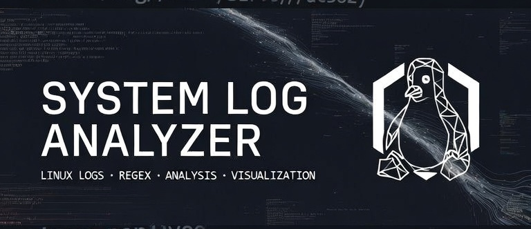

<div align="center">

<br>


<br>



<br>

### Linux System Log Analyzer

**A lightweight Python tool for collecting, parsing, analyzing, and visualizing Linux system logs.**

<br>

</div>

---

## `01` — About

> **What happens when thousands of Linux log entries become structured data?**

Linux systems continuously generate logs as **processes run, services communicate, and system events occur**.

This project takes raw entries from `/var/log/syslog` and turns them into structured information that can be analyzed from different perspectives.

```text
                    /var/log/syslog
                           │
                           ▼
                  ┌─────────────────┐
                  │  Data Collector │
                  └────────┬────────┘
                           │
                           ▼
                  ┌─────────────────┐
                  │  Regex Parser   │
                  └────────┬────────┘
                           │
                           ▼
                  ┌─────────────────┐
                  │    Analyzer     │
                  └────────┬────────┘
                           │
             ┌─────────────┼─────────────┐
             ▼             ▼             ▼
         Processes        PIDs          Time
             │             │             │
             └─────────────┼─────────────┘
                           ▼
                  ┌─────────────────┐
                  │  Visualization  │
                  └─────────────────┘
```

The goal is simple:

> **Turn raw Linux logs into information that is easier to understand and investigate.**

---

## `02` — Features

| Feature                   | Description                                       |
| ------------------------- | ------------------------------------------------- |
| **Log Collection**        | Collect logs from `/var/log/syslog`               |
| **Regex Parsing**         | Extract structured information from raw log lines |
| **Process Analysis**      | Count and compare process activity                |
| **PID Analysis**          | Analyze process IDs and their frequency           |
| **Process Filtering**     | Investigate a specific process                    |
| **Process Ranking**       | Find the most and least frequent processes        |
| **Time Analysis**         | Measure activity across one-hour ranges           |
| **Process Visualization** | Visualize the most frequent processes             |
| **Time Visualization**    | Visualize system activity by hour                 |
| **CLI**                   | Control the analyzer through `argparse`           |

---

## `03` — Project Structure

```text
.
├── datacollector.py
├── parser.py
├── analyzer.py
├── visualizer.py
├── main.py
└── log.txt
```

> **Note**
>
> `log.txt` is generated automatically when the log collection command is executed and is not required to exist beforehand.

---

## `04` — Data Collection

### `datacollector.py`

The collector reads the Linux system log:

```text
/var/log/syslog
```

and creates:

```text
log.txt
```

inside the project directory.

The workflow is intentionally simple:

```text
Linux System
     │
     └── /var/log/syslog
              │
              ▼
       Data Collector
              │
              ▼
           log.txt
```

Run:

```bash
python main.py --collog
```

Output:

```text
collecting logs from system...
Done
```

---

## `05` — Parsing

### `parser.py`

Raw log lines are not particularly convenient to analyze.

The parser uses **Regular Expressions** to extract the useful parts of each entry.

For example:

```text
2026-09-27T16:52:22.397784+03:30 ubuntu apparmor.systemd[1260]
```

becomes:

```text
Time      → 16:52:22
Hostname  → ubuntu
Process   → apparmor.systemd
PID       → 1260
```

The extracted information is then stored in a structured form and passed to the analyzer.

> **Why Regex?**
>
> Because system logs follow recognizable patterns, Regular Expressions provide a lightweight way to identify and extract the fields we need.

---

## `06` — Analysis

### Process Analysis

The analyzer answers questions such as:

> **Which processes are generating the most activity?**

It can calculate:

* **Unique processes**
* **Process occurrence counts**
* **Most frequent processes**
* **PID occurrence counts**
* **Most frequent PIDs**

Example:

```text
Process              Occurrences
--------------------------------
systemd                   1240
sshd                       730
NetworkManager             512
```

---

### Process Filtering

Sometimes the interesting question is about **one specific process**.

```bash
python main.py --slog systemd
```

Example:

```text
log_name: systemd number : 1240
```

This allows a specific process to be investigated without displaying the entire dataset.

---

### Process Ranking

The analyzer can rank processes by frequency.

#### Most Frequent

```bash
python main.py --top 10
```

Example:

```text
[
    ('systemd', 1240),
    ('sshd', 730),
    ('NetworkManager', 512)
]
```

#### Least Frequent

```bash
python main.py --tail 10
```

This provides the opposite view and can help identify processes that appear only occasionally.

---

## `07` — Time Analysis

> **Process analysis tells us *what* is happening.**
> **Time analysis tells us *when* it is happening.**

The parser preserves the timestamp down to the **second**:

```text
16:52:22
16:52:23
16:52:25
```

The analyzer then groups events into **one-hour ranges**.

For example:

```text
00:00–01:00 → 44
01:00–02:00 → 47
02:00–03:00 → 151
17:00–18:00 → 33
18:00–19:00 → 120
19:00–20:00 → 21
20:00–21:00 → 23
21:00–22:00 → 32
```

### Why is this useful?

It gives us a quick view of **when the system was most active**.

For example:

```text
02:00–03:00 → 151 events
```

means that this was one of the busiest recorded time ranges in the collected logs.

> **Important**
>
> Empty hours are not included.
> If there are no log entries for a specific hour, that hour is not added to the analysis.

---

## `08` — Visualization

The project uses **Matplotlib** to turn the analyzed data into visual information.

### Process Frequency

```bash
python main.py --plot
```

This generates a horizontal bar chart containing the **Top 10 most frequent processes**.

The chart answers:

> **Which processes dominate the collected logs?**

---

### Activity by Hour

```bash
python main.py --plot-time
```

This generates a bar chart showing the number of log entries recorded during each hour containing activity.

```text
Occurrences
    │
151 │          █
    │          █
120 │          █        █
    │          █        █
 47 │    █     █        █
 44 │ █  █     █        █
    └────────────────────────
      00  01   02      18
                  Time
```

The visualization makes activity peaks much easier to spot than reading raw numbers.

---

## `09` — CLI

The entire project can be controlled through command-line arguments.

| Command          | Purpose                             |
| ---------------- | ----------------------------------- |
| `--collog`       | Collect system logs                 |
| `--sholog`       | Show analysis statistics            |
| `--slog PROCESS` | Analyze a specific process          |
| `--top N`        | Show the N most frequent processes  |
| `--tail N`       | Show the N least frequent processes |
| `--plot`         | Visualize top processes             |
| `--plot-time`    | Visualize activity by hour          |

### Example

Run several operations together:

```bash
python main.py --collog --top 10 --plot-time
```

This will:

```text
1. Collect the latest logs
2. Analyze process frequency
3. Select the top 10 processes
4. Display the time-based visualization
```

---

## `10` — Installation

Clone the repository:

```bash
git clone <repository-url>
cd <repository-directory>
```

Install the required dependency:

```bash
pip install matplotlib
```

The project also uses Python standard-library modules such as:

```text
argparse
re
os
```

No additional installation is required for them.

---

## `11` — Technologies

| Technology              | Role                              |
| ----------------------- | --------------------------------- |
| **Python**              | Core programming language         |
| **Regular Expressions** | Log parsing                       |
| **Linux**               | Source system and log environment |
| **argparse**            | CLI interface                     |
| **Matplotlib**          | Data visualization                |

---

## `12` — What I Learned

This project was built around **real Linux system data**, rather than manually created input.

During development, I practiced:

* Reading and processing Linux system logs
* Working with `/var/log/syslog`
* Designing Regular Expressions for structured extraction
* Preserving timestamps with second-level precision
* Processing thousands of log entries
* Working with dictionaries and aggregation
* Performing time-based analysis
* Building command-line interfaces
* Creating visualizations with Matplotlib
* Separating collection, parsing, analysis, and visualization

More importantly, the project helped connect three different concepts:

```text
Raw Data
   │
   ▼
Understanding
   │
   ▼
Analysis
   │
   ▼
Security Insight
```

---

## `13` — Future Improvements

The project is intentionally kept small and focused, but there are several directions for future development.

### Log Sources

* [ ] Support additional Linux log files
* [ ] Support different log formats
* [ ] Improve compatibility across Linux distributions

### Security Analysis

* [ ] Authentication event analysis
* [ ] Failed login detection
* [ ] `sudo` activity analysis
* [ ] IP address extraction
* [ ] Suspicious process detection
* [ ] Basic anomaly detection

### Data & Visualization

* [ ] Date-based filtering
* [ ] More detailed time analysis
* [ ] Additional visualization types
* [ ] JSON / CSV export
* [ ] More flexible command-line filters

> **Long-term direction**
>
> Gradually move from basic log parsing toward **security-oriented log analysis and detection**, while keeping the project lightweight and understandable.

---

## `14` — Disclaimer

> This project is built for **learning and educational purposes**.
>
> It is a lightweight log-analysis project and **is not intended to replace a production security monitoring system or SIEM**.

---

<div align="center">

<br>


</div>

